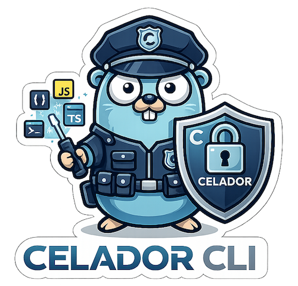

<p align="center">
  
</p>

# 🛡️ Celador CLI

> "The security deadlock for your dependencies."

Celador is a zero-trust supply chain security CLI for modern JavaScript/TypeScript ecosystems. Written in Go, Celador scans dependencies, flags risky framework configuration, and helps apply conservative remediations with deterministic non-interactive behavior.

## 🚀 Features

- **`celador init` (Guided Setup):** Detects your package manager, merges hardening rules into supported config files, refreshes managed guidance blocks, and can install a Git hook only when explicitly requested.
- **`celador install` (Zero-Trust Wrapper):** Automatically detects your package manager, downloads tarballs into a temporary sandbox, and performs heuristic analysis (detecting network requests with env vars) *before* installing anything.
- **`celador scan` (Deterministic OSV Scanning):** Uses Google's OSV.dev batch API with a lockfile-fingerprint cache and TTL-based OSV cache for repeat scans and offline-friendly fallback indicators.
- **Framework Fingerprinting & SAST:** 
  - Validates **Next.js**, **Nuxt.js**, **SvelteKit**, and **Strapi** config files to prevent source code leaks, SSRF, and default cryptographic keys.
  - Mitigates **Tailwind CSS v4** XSS risks by detecting dynamic arbitrary value interpolation (`bg-[${input}]`).
- **Proactive Hardening:** 
  - Disables arbitrary `postinstall` scripts (`ignore-scripts=true`).
  - Sets `minimumReleaseAge: 1440` (24 hours) to prevent Day-0 hijacked package installations.
  - Automatically fixes `.gitignore` to prevent leaking `.env.local` and sourcemaps (`*.map.js`).
- **AI Agent Guidelines:** Automatically provisions `AGENTS.md` and `CLAUDE.md` with strict rules to prevent AI coding assistants from introducing vulnerable dependency patterns, and includes an `llm.txt` file for complete AI context.
- **Smart Remediation:** Use `celador fix --diff` to preview conservative version bumps and `celador fix --yes` to apply supported manifest changes without an interactive prompt.

## 📦 Installation

Celador is distributed as a precompiled Go CLI binary.

### macOS and Linux (Homebrew)

Use Homebrew on supported macOS and Linux environments:

```bash
brew tap GustavoGutierrez/celador
brew install GustavoGutierrez/celador/celador
```

The tap command above is correct after the dedicated tap migration because Homebrew resolves
`brew tap GustavoGutierrez/celador` to the repository `GustavoGutierrez/homebrew-celador`.

Upgrade with the normal Homebrew flow:

```bash
brew update
brew upgrade celador
```

Uninstall with:

```bash
brew uninstall celador
brew untap GustavoGutierrez/celador
```

### Windows

Do **not** install Celador on Windows with Homebrew. Download the Windows release asset from GitHub
Releases instead:

- Releases: `https://github.com/GustavoGutierrez/celador/releases`
- Expected archive: `celador_X.Y.Z_windows_amd64.zip`

## 🛠️ Usage

### 1. Initialize
Set up Celador in an existing project and configure your pre-commit hooks:
```bash
celador init
```

### 2. The Safe Install
Replace your daily `npm install` with Celador's secure wrapper:
```bash
celador install express
```

### 3. Audit and Fix
Run a deterministic audit and preview conservative remediations:
```bash
celador scan
celador fix --diff
celador fix --yes
```

### 4. Install with preflight
Inspect npm-compatible package metadata before delegating to the package manager:
```bash
celador install express
celador install left-pad --yes
```

## 🏗️ Architecture & Contributing

Celador is built using **Hexagonal Architecture (Ports & Adapters)** in Go.
- The project strictly follows **Spec Driven Development (SDD)**. Specs and behavioral tests must be written before implementation.
- All codebase elements, comments, and internal Software Design Documents are strictly written in **English**.
- CLI routing is powered by `spf13/cobra`, with plain-text output as the default runtime surface.
- Follows standard Go project layout and strict naming conventions.
- Comprehensive Unit Tests cover all domains.

## 📄 License
MIT License.
